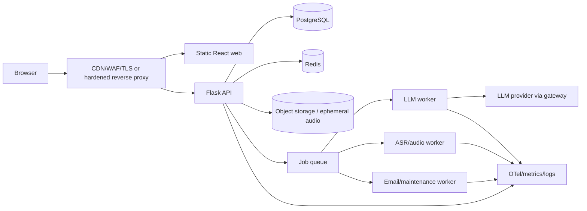
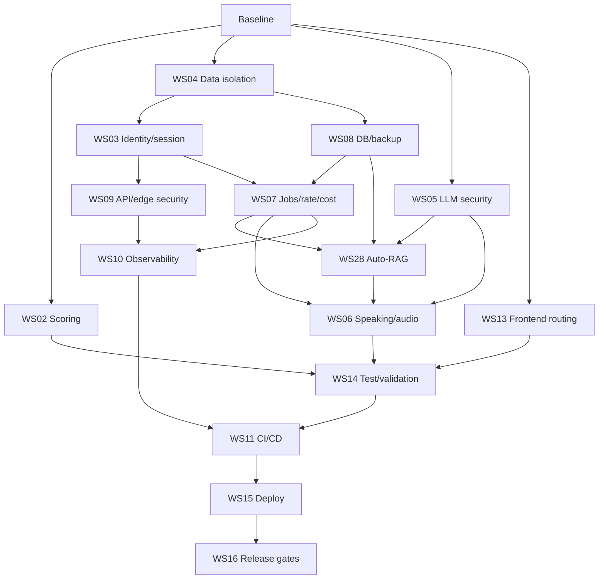

# 00 — Master Production Roadmap

## Objective
Move the current application from self-hosted/small-user readiness to a defensible public multi-user production service while preserving its current Flask + React architecture.

## P0 blockers from the reviewed baseline
1. IELTS overall-band rounding uses Python banker’s rounding and can turn an average of `6.25` into `6.0`; official IELTS rules require `6.25 → 6.5` and `.75 → next whole band`.
2. `docker-compose.prod.yml` uses PostgreSQL 18 with the legacy `/var/lib/postgresql/data` volume target. The official PostgreSQL 18 image changed the declared volume to `/var/lib/postgresql`.
3. Account deletion does not include all user-owned FK tables such as gate/feedback/generation usage in the reviewed implementation; public deletion must be complete and constrained by schema.
4. Scoring prompts interpolate learner content into system-level prompt text. This violates the required trust boundary and creates a prompt-injection path.
5. Speaking numeric scoring includes pronunciation while the scorer only receives transcript text. That score must not be represented as examiner-equivalent.

## Target state


## Work phases
### Phase 0 — Freeze and measure
- Tag the current tested baseline.
- Run current API/web tests and save results.
- Add a production-readiness issue/milestone.
- Do not change runtime behavior in this phase.

**Exit:** reproducible baseline and known failing/green tests.

### Phase 1 — Correctness and tenant isolation
Execute:
- `02_IELTS_SCORING_INTEGRITY.md`
- `04_MULTI_USER_DATA_ISOLATION.md`
- PostgreSQL 18 volume fix from `08_DATABASE_MIGRATIONS_BACKUP_DR.md`

**Exit:** correct band rounding; all user-owned resources scoped; deletion works with every child table; migration tests pass.

### Phase 2 — Identity and request security
Execute:
- `03_IDENTITY_SESSION_SECURITY.md`
- `09_API_EDGE_SECURITY.md`

**Exit:** server-side revocable sessions; CSRF; email verification/reset hardening; admin protections; trusted-host/proxy/security-header policy.

### Phase 3 — Shared runtime controls
Execute:
- `07_JOBS_RATE_LIMIT_COST_CONTROL.md`
- `08_DATABASE_MIGRATIONS_BACKUP_DR.md`
- `10_OBSERVABILITY_SRE.md`
- `27_AI_TOKEN_ECONOMY_AND_TASK_POOLING.md`
- `28_AUTO_RAG_KNOWLEDGE_PIPELINE.md`

**Exit:** Redis-backed global controls, separated heavy workloads, idempotent jobs, provider cost caps, append-only provider usage accounting, pool-first standard practice with budget-aware replenishment, selective Auto-RAG knowledge ingestion/retrieval, backups and restore drill, production telemetry.

### Phase 4 — AI validity and speaking
Execute:
- `05_LLM_SECURITY_AND_CALIBRATION.md`
- `06_SPEAKING_ASR_AUDIO_PIPELINE.md`
- scoring portions of `14_TEST_VALIDATION_STRATEGY.md`

**Exit:** system/user prompt separation; strict server schemas; versioned prompts/models; calibration harness; speaking result no longer invents pronunciation evidence.

### Phase 5 — Public UX, privacy, and delivery
Execute:
- `12_PRIVACY_COMPLIANCE.md`
- `13_FRONTEND_ROUTING_ACCESSIBILITY.md`
- `11_CI_CD_SUPPLY_CHAIN.md`

**Exit:** truthful product wording, privacy/retention controls, route-based app UX, WCAG-oriented checks, staging CI/CD security gates.

### Phase 6 — Staging and launch gates
Execute:
- `14_TEST_VALIDATION_STRATEGY.md`
- `15_DEPLOYMENT_RUNBOOK.md`
- `16_RELEASE_GATES.md`

**Exit:** load/security/E2E/calibration/restore checks pass in staging; rollback exercised; no unresolved P0/P1 release gate.

## Dependency graph


## Provisional service objectives
These are starting engineering targets, not contractual promises:
- Availability: 99.9% monthly for core authenticated API after GA; beta may target 99.5%.
- API non-AI P95 latency: <500 ms under expected steady load.
- LLM/ASR endpoints: asynchronous/job-based where they cannot reliably meet interactive latency.
- Error rate for non-user-caused 5xx: <1% over 5 minutes; page at higher sustained rates.
- Backup: daily logical/snapshot backup minimum; production-standard profile should use PITR where the provider supports it.
- Initial RPO target: ≤24 h for beta; ≤15 min for production-standard with PITR.
- Initial RTO target: ≤4 h beta; ≤1 h production-standard. Validate with restore drills before making public promises.

## Do not do yet
- Do not introduce Kubernetes solely for “production” status.
- Do not split every domain into a microservice.
- Do not fine-tune a scoring model before a labeled calibration/evaluation dataset exists.
- Do not store raw audio indefinitely by default.
- Do not enable cross-origin API access unless a concrete client needs it.
- Do not promise official IELTS equivalence.
- Do not launch a public social feed/follower system before peer-demand validation.
- Do not automate Study Pod matching before manual matching produces repeat value.
- Do not build a tutor marketplace/payment stack before human-help demand and supply are validated.
- Do not make WhatsApp a required learning surface.
- Do not start JLPT implementation from IELTS assumptions without separate discovery.

## ARUORA product-validation overlay

Production hardening and product validation run as two coordinated tracks.

```text
Engineering baseline
  ↓
Core P0 production hardening
  ├── WS20 product/domain contract
  ├── WS21 telemetry/cohorts
  └── WS23 ARUORA rebrand groundwork
  ↓
Wave 0 Internal QA
  ↓
Wave 1 Lecturer Controlled UAT
  ↓
Wave 2 LinkedIn Market UAT
  ↓
Wave 3 Founding Beta
  ↓
Study Pool evidence
  ↓
Manual Study Pods (only if validated)
```

Additional workstreams:
- `27_AI_TOKEN_ECONOMY_AND_TASK_POOLING.md` — shared practice inventory, provider-usage ledger, generation budgets, anti-repeat selection, and replenishment.
- `28_AUTO_RAG_KNOWLEDGE_PIPELINE.md` — approved-source Auto-RAG ingestion, pgvector/full-text hybrid retrieval, source provenance, retrieval evaluation, and grounding for Aura/Task Pool generation.
- `20_ARUORA_PRODUCT_FOUNDATION.md`
- `21_PRODUCT_DATA_ANALYTICS_AND_EXPERIMENTS.md`
- `22_UAT_FOUNDING_BETA_RELEASE_PLAN.md`
- `23_BRAND_UI_AURA_IMPLEMENTATION.md`
- `24_STUDY_POOL_COMMUNITY_SAFETY_ARCHITECTURE.md`
- `25_WHATSAPP_REENGAGEMENT_ARCHITECTURE.md`
- `26_HUMAN_ESCALATION_AND_MONETIZATION_BOUNDARIES.md`

Do not let brand work bypass security/correctness gates, and do not let production hardening erase the product's Destination → Readiness → Next Action hierarchy.

## Program-level definition of done
Public launch requires every MUST in `16_RELEASE_GATES.md`. A workstream being merged does not mean production readiness is complete.

## AI economy architecture overlay

Before external UAT, standard practice generation must move toward:

```text
Pool inventory forecast
        ↓
Budget-aware generation batch
        ↓
Schema + quality + duplicate validation
        ↓
ACTIVE shared task bank
        ↓
Per-user eligible weighted selection
        ↓
Task exposure / completion
```

The existing `GeneratedSet` is the migration starting point, not a reason to continue generating per user. The existing `GenUsage(user/day/count)` is a compatibility counter, not sufficient production cost accounting. WS27 defines the replacement/evolution contract.


## Auto-RAG architecture overlay

RAG is a knowledge-plane capability, not a universal request middleware. The first implementation should reuse PostgreSQL through pgvector + full-text search. Approved sources are versioned and automatically refreshed through workers; active chunks are retrieved with namespace/allowed-use/authorization prefilters. Dynamic RAG is excluded from calibrated scoring and exact learner-state access. Background Task Pool generation may use RAG-grounded context and must persist provenance. See WS28.
