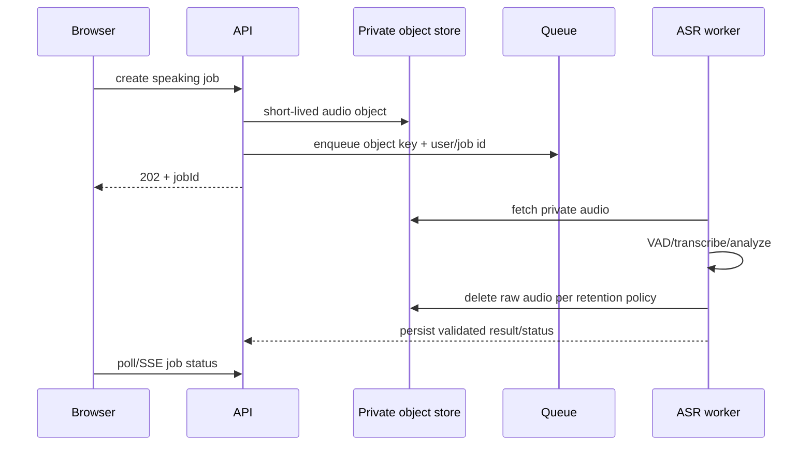

# 06 — Speaking, ASR, and Audio Evidence Pipeline

## Goal
Stop treating a transcript as sufficient evidence for all four IELTS Speaking criteria, while retaining useful AI practice feedback.

## Key validity constraint
Official IELTS Speaking assessment includes Pronunciation and describes phonological features such as rhythm, stress, intonation, connected speech, phoneme production, and intelligibility. A text transcript cannot contain most of that evidence.

Therefore the production platform must either:
1. mark pronunciation as unassessed/text-inferable only and avoid a full speaking-band claim; or
2. add an audio evidence pipeline and validate it against human ratings before using it in a full estimate.

## Dependencies
Requires WS05 LLM trust boundary and WS07 job/queue architecture.

## WS06 ownership
Expected areas:
- `api/app/services/asr.py`
- speaking routes/services
- new audio-analysis worker code
- audio/job models only through coordinated migrations
- speaking tests and calibration harness
- speaking frontend result wording

## Task WS06-01 — Immediate correctness fix
Before advanced audio scoring exists:
- rename transcript-only scoring as `Speaking text estimate` or equivalent;
- set pronunciation to `unassessed` or clearly `approximate_without_audio`;
- do not average a fabricated pronunciation value into a result labeled as full Speaking band;
- keep the separate pronunciation drill clearly labeled approximate.

This can ship before the full audio pipeline.

## Task WS06-02 — Queue ASR
Move raw audio decode/transcription out of synchronous Gunicorn workers.

Flow:


Never expose a public permanent audio URL.

## Task WS06-03 — Audio feature contract
Implement a provider/model-neutral feature interface before selecting a scoring model:
```json
{
  "duration_sec": 42.1,
  "speech_sec": 36.8,
  "words_per_minute": 118,
  "pause_count": 7,
  "long_pause_count": 2,
  "mean_pause_ms": 410,
  "asr_confidence": null,
  "prosody": {...},
  "alignment": {...},
  "quality": {"snr": null, "clipping": false}
}
```

Possible implementation technologies (forced alignment, phoneme models, Praat/Parselmouth/librosa-class features, Whisper timestamps) must be benchmarked; do not select one solely because it is easy to install.

## Task WS06-04 — Audio quality gate
Before scoring:
- validate supported MIME/container;
- decode safely in a constrained worker;
- maximum duration and bytes;
- reject silence/near-silence;
- detect gross clipping/noise where possible;
- VAD to identify actual speech;
- malware/parser surface minimized by patched decode dependencies and resource limits.

Return “insufficient audio quality” rather than a confident score.

## Task WS06-05 — Pronunciation estimator validation
Build an evaluation set with consented/licensed audio and human speaking criterion scores. Compare candidate feature/model pipelines using:
- agreement with human pronunciation ratings;
- overall speaking agreement when combined;
- accent/subgroup error analysis where lawful and sample size supports it;
- robustness to microphone/noise/device changes;
- repeated-run stability.

Accent must not be penalized merely for being non-native; intelligibility and criterion-relevant phonological control are the target.

## Task WS06-06 — Fluency evidence
Audio can improve Fluency/Coherence estimation with:
- speech rate;
- pauses;
- filled pauses;
- self-correction/repetition proxies;
- turn length.

These signals support, but do not replace, semantic/coherence assessment. Keep deterministic audio metrics distinct from LLM judgment in stored metadata.

## Task WS06-07 — Retention and consent
Default production recommendation:
- raw audio is ephemeral and deleted after successful processing or short failure TTL;
- transcript/derived metrics retained only according to the user-facing privacy policy;
- optional “save my recordings for progress playback” requires explicit opt-in and a retention/deletion UI;
- never reuse recordings for model training/calibration without separate valid consent/licensing.

## Task WS06-08 — Worker isolation
ASR workers need independent resource limits:
- CPU/GPU concurrency;
- memory limit;
- max job duration;
- temp disk limit;
- queue length/backpressure;
- cancellation/cleanup.

A burst of recordings must not starve login, history, or ordinary API requests.

## ARUORA product behavior

Speaking UI must distinguish:
- transcript-derived language feedback;
- acoustic pronunciation/fluency evidence;
- unavailable/low-quality audio evidence.

Aura may say “I could not assess pronunciation reliably from this recording” rather than filling a score to keep the interface visually complete.

For future peer Speaking sessions, private assessment audio must never be automatically shared with Study Pod members. Peer-session recording, if ever introduced, requires a separate consent/retention design.

## Exit criteria
No transcript-only request is represented as fully assessing pronunciation, raw audio is processed asynchronously with bounded resources and deletion policy, and any full Speaking estimate has evidence/calibration appropriate to all included criteria.
